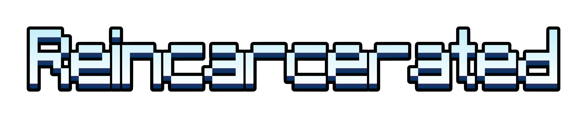

# The Escapists Reincarcerated Repository

This is the repository for The Escapists Reincarcerated.

The Escapists Reincarcerated is a remake of The Escapists in Unity.

This is only officially supported for Windows systems. Linux work-arounds can be found in the Discord (linked below).

The CTFAK 2.0: https://github.com/CTFAK/CTFAK2.0 (you do NOT have to download this)

Discord: https://discord.gg/pPWrSgwBRW

For fully built and "stable" releases, go to the "Releases" section.

TER uses Unity 6000.3.9f1 as of February 24, 2026. This is not expected to change, however, there have been multiple older versions of Unity used throughout this project in older commits. Don't ask me which ones at what time, because you can check for yourself! :)

The source code presented in the ```main``` branch is stuff pushed daily, and will not be the same as what is seen in the released versions most of the time.

# Installation

Note: There is a warning screen that will appear at the start of the game if you do not have everything installed correctly.

## Dependencies

Download the latest release of The Escapists Reincarcerated.

The Escapists on Steam with all DLC: https://store.steampowered.com/app/298630/The_Escapists

.NET 6.0 Desktop Runtime, .NET 6.0 Runtime, and ASP.NET Core Runtime 6.0

These can be found here: https://dotnet.microsoft.com/en-us/download/dotnet/6.0

Python 3.4+: https://www.python.org/downloads/

PyPI blowfish Package: https://pypi.org/project/blowfish (Paste ```py -3 -m pip install blowfish``` into Command Prompt.)

## Setting The Escapists File Path

The game will not load properly if you do not have a valid path for The Escapists.

In the root of the The Escapists Reincarcerated directory, go to this folder: "The Escapists Reincarcerated_Data/StreamingAssets/CTFAK".

In this folder, go into the "config.ini" file to change the directory of your The Escapists folder path at "GameFolderPath" under "Settings" in that file. 

Example path: C:\Program Files (x86)\Steam\steamapps\common\The Escapists

# Troubleshooting

## "The game loads, but all the assets are white."

This happens because either CTFAK didn't open, or the game is having trouble loading the memory mapped file.

If CTFAK did open, just re-open the game, and it should work. This is a known bug and will be fixed in subsequent releases.

If CTFAK did *not* open, make sure you have installed all of the needed dependencies.

## "The game seems to load fine, but prisons don't open."

This is most likely caused due to the game not having all of the tilesets from The Escapists.

This means you either don't have all of the DLC for The Escapists installed, or you haven't installed Python or the blowfish PyPI package.

## "I can't find the TER executable."

This is probably because you downloaded the source code of the project and not an actual release.

## Unlisted Issues

If you are having an issue that is not mentioned here, join the Discord server and ask for help there.

# Frequently Asked Questions

## "Do I really need to have all the DLC for The Escapists?"

Yes. The game will not work without the DLC.

## "Can I use a pirated version of The Escapists?"

No. Most likely, it will not work. Either way, you should really buy The Escapists on Steam. This is not a project that will allow for piracy of The Escapists.

## "What new features does this have over the original Escapists?"

This game focuses on bringing more quality-of-life features to The Escapists, such as widescreen support, new and improved UI, more customizability, and much more.

## "Is this a mod?"

No. This is a completely new game and not a mod.

## "Will there be modding support?"

Modding is not currently supported, however, I do intend on maybe adding it in the future.

## "How many people are working on this game?"

Just me! However, many people have helped in other ways towards this game's creation. See the credits in-game. If you would like to help with the creation of this game, please reach out or submit a PR!

## "Is this an official remaster?"

No. This is a fan-made remaster of The Escapists.

## "What does Team17 think of this project?"

From what I can see, they are indifferent. There was a DMCA attack on this repository in early 2026, however it most likely did not come from Team17, as they did not respond to my counter-claim.

## "How can I see the progress of this project?"

You can either join the Discord server (linked above) or watch the dev logs on my YouTube channel (https://www.youtube.com/@iliketheturtles14).

## "Will there be support for other platforms?"

Currently, no. However, there have been some work-arounds to have some Linux compatibility. MacOS will never be supported and neither will mobile platforms.
